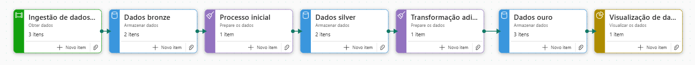
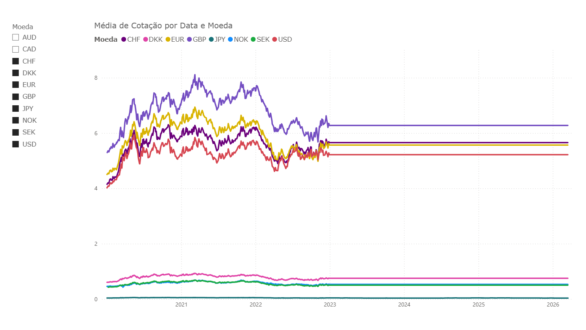

# 📈 Data Pipeline: Cotações de Moedas com Arquitetura Medallion (Microsoft Fabric)

Este projeto demonstra a construção de um pipeline de dados End-to-End utilizando o **Microsoft Fabric**. O fluxo realiza a extração de cotações de moedas diretamente da API do Banco Central do Brasil, processa os dados utilizando **PySpark** e **Spark SQL**, e os disponibiliza para análise em um relatório do **Power BI**.

---

## Objetivo
Criar uma esteira automatizada e resiliente para ingestão, tratamento e modelagem de dados financeiros, garantindo alta performance de leitura e histórico confiável das variações cambiais.

---

## Arquitetura do Projeto (Medallion)
O fluxo de dados foi desenhado seguindo as melhores práticas da Arquitetura Medallion, garantindo qualidade e governança dos dados ao longo de toda a jornada. Abaixo, apresento o diagrama visual dessa estrutura:

### Detalhamento Técnico das Etapas:

1. **01_Ingestao:** Notebook que realiza a conexão com a API OData do Banco Central e a extração paginada de cotações utilizando Python.
2. **02_Bronze:** Os dados são salvos em sua forma nativa (arquivos `.parquet`) na pasta 'Files/Cotacoes/Novos' no OneLake.
3. **03_Bronze_To_Silver:** Notebook que realiza a leitura dos dados brutos, aplica limpeza básica (como tipagem de dados e remoção de duplicatas) e realiza uma carga incremental segura (Upsert) na tabela Delta histórica.
4. **04_Silver:** Tabela Delta gerenciada (`cotacoes`), particionada por moeda para otimizar consultas.
5. **05_Silver_To_Gold:** Notebook que aplica regras de negócio e consolida as tabelas para modelo de negócio.
6. **06_Gold (Modelagem):** Criação das tabelas fatos e dimensões otimizadas para consumo (ex: `ft_cotacoes`, `masterdata_moedas`).
7. **07_Visualizacao:** Relatório **"PBI Moedas"** conectado nativamente via *Direct Lake*, garantindo performance em tempo real sem duplicação de dados.

---

## 🛠️ Tecnologias Utilizadas
* **Orquestração & Processamento:** Microsoft Fabric, PySpark, Data Pipelines, Notebooks
* **Armazenamento:** OneLake, Delta Lake (formato Delta/Parquet)
* **Linguagens:** Python, SQL
* **Visualização:** Power BI (Direct Lake)

---

## Destaques Técnicos Implementados
* Implementação de parâmetros dinâmicos para processamento em loop de múltiplas moedas.
* Tratamento de exceções (`try-except`) para garantir a resiliência do pipeline quando não há novos arquivos na API.
* *Housekeeping* automatizado de arquivos usando `mssparkutils`.
* Uso de tabelas particionadas e formato Delta para alta performance em Big Data.

---

## Visualização Final (Dashboard Power BI)
A imagem abaixo apresenta o resultado final do pipeline: o relatório do Power BI consumindo os dados modelados da camada Gold em tempo real.

---

##
Sinta-se à vontade para se conectar comigo no [LinkedIn](https://www.linkedin.com/in/deivisonmartins/) para trocarmos ideias sobre Engenharia e Análise de Dados!
